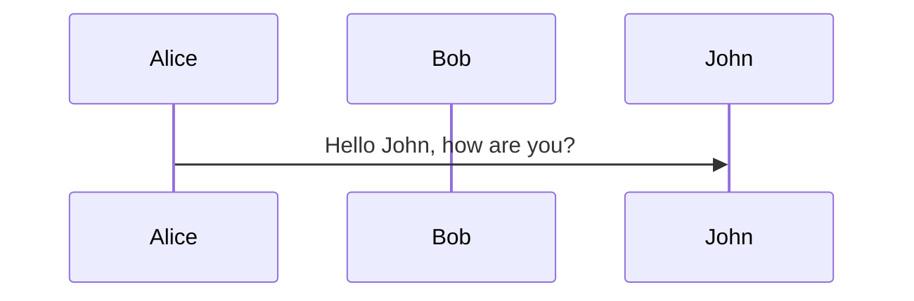
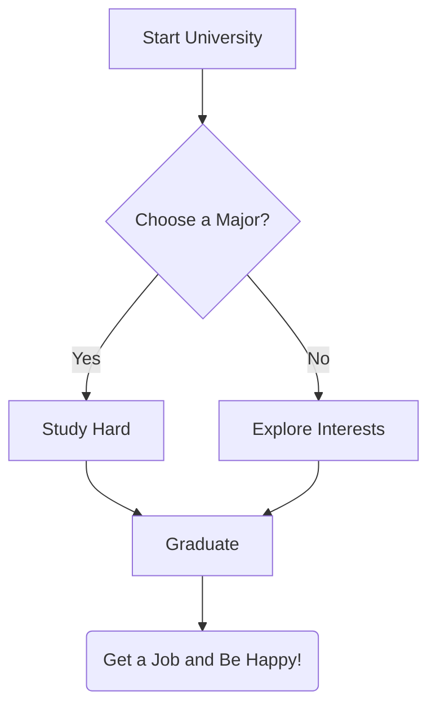

+++
date = '2025-10-15T17:46:59+08:00'
title = 'R Programming - CART'
+++

# Classification and Regression Tree (CART) - Continuous Y

We will be using the `mtcars` built in RStudio for this part.

## Import Libraries and Dataset
```R
library(rpart)
library(rpart.plot)

data(mtcars)
```
- `rpart` full form is Recursive partitioning and Regression Trees - This builds decision trees
- `rpart.plot` is used to plot out trees in a graphical form 

- `data(mtcars)` for importing the "mtcars" dataset

## Building the Cart Model
```R
set.seed(2014)

cart1 <- rpart(mpg ~ ., data = mtcars, method = "anova", 
                control = rpart.control(minsplit = 2, cp = 0))
```

- `set.seed(2014)` - This is to ensure producibility of the results
- `cart1 <- rpart` - We first call the rpart function and store it in a variable named "cart1"
- `mpg ~ .` basically means "Predict *mpg* (Miles per Gallon) using all the other variables in the dataset. The period ( *.* ) is just a shorthand for "all other columns of variables"
- `data = mtcars` - Use the `mtcars` dataset
- `method = "anova"` - For all Y variables that are continuous, we have to use the "anova" method for CART as "anova" stands for Analysis of Variance (ANOVA)
- `control = rpart.control()` - Controls specific parameters for tree-building process
- `minsplit = 2` - This sets the minimum number of observations (cars) required in a node for the CART algorithm to do a split.
- `cp - 0` - Complexity Parameter. Setting to zero means that the tree will ignore any cost-complexity prunning and just build into the largest possible tree until theres' no further split or any improvement


## Results and Tree

``` text
Regression tree:
rpart(formula = mpg ~ ., data = mtcars, method = "anova", control = rpart.control(minsplit = 2, 
    cp = 0))

Variables actually used in tree construction:
[1] cyl  disp drat hp   qsec vs   wt  

Root node error: 1126/32 = 35.189

n= 32 

           CP nsplit  rel error  xerror     xstd
1  6.5266e-01      0 1.0000e+00 1.06389 0.252198
2  1.9470e-01      1 3.4734e-01 0.68629 0.160870
3  4.5774e-02      2 1.5264e-01 0.47604 0.119551
4  2.5328e-02      3 1.0686e-01 0.44324 0.117846
5  2.3250e-02      4 8.1534e-02 0.40281 0.115329
6  1.2488e-02      5 5.8285e-02 0.38559 0.106955
7  1.2149e-02      6 4.5796e-02 0.35818 0.105197
8  1.1647e-02      7 3.3648e-02 0.34943 0.105751
9  9.6700e-03      8 2.2000e-02 0.34357 0.104871
10 1.8010e-03      9 1.2330e-02 0.33605 0.112381
11 1.8010e-03     10 1.0529e-02 0.31304 0.099915
12 1.5156e-03     11 8.7282e-03 0.29965 0.090460
13 1.2868e-03     12 7.2125e-03 0.30216 0.090476
14 9.9907e-04     14 4.6389e-03 0.29853 0.089054
15 9.2506e-04     15 3.6399e-03 0.29704 0.089144
16 8.5254e-04     16 2.7148e-03 0.29628 0.089205
17 7.5041e-04     17 1.8623e-03 0.29221 0.089117
18 3.5967e-04     18 1.1119e-03 0.29642 0.088779
19 2.8418e-04     19 7.5219e-04 0.29642 0.088779
20 2.0011e-04     20 4.6801e-04 0.29479 0.088862
21 1.1101e-04     21 2.6790e-04 0.29055 0.086900
22 7.1045e-05     22 1.5689e-04 0.29013 0.086937
23 3.9963e-05     23 8.5846e-05 0.29080 0.086896
24 5.9204e-06     25 5.9204e-06 0.29159 0.086831
25 0.0000e+00     26 0.0000e+00 0.29237 0.087231
```
Let's slow down and interpret the column names:
- `nsplit` - How many internal nodes the tree has or just number of splits
- `rel error` - Relative Training Error, this always decreases as the tree grows 
- `xerror` - Cross-Validation Error. The error on unseen data, estimated using the 10-fold cross-validation 
- `xstd` - Standard Deviation for the Cross-Validation Error.
- `CP` - Complexity Parameter. The minimum improvement in relative error required at that step to justify another split. This is the value one should use when we want to prune the tree

We also see above the table there is: Root node error: 1126/32 = 35.189
- This is the total Sum of Squared Error (SSE) for the entire dataset before any split

### Implications
1.) We first find the minimum Cross-Validation Error from the `xerror` column which is:
```text
           CP nsplit  rel error  xerror     xstd
23 3.9963e-05     23 8.5846e-05 0.29080 0.086896
```

2.) Next, we need to find the target threshold:  
`target = Minimum xerror + xstd at minimum`  
`target = 0.29080 + 0.086896 = 0.377696` 

3.) Finally, apply the 1-SE Rule. Search for the smallest tree whose xerror is just less than the Target Threshold. Include it and one node above it:
```Text
           CP nsplit  rel error  xerror     xstd
6  1.2488e-02      5 5.8285e-02 0.38559 0.106955
7  1.2149e-02      6 4.5796e-02 0.35818 0.105197

```

Since the 7th tree is the most optimal, we pick any CP value between the 6th and the 7th using squareroot function:
`cp1 <- sqrt(1.2149e-02*1.2488e-02)`  
which gives us `0.01231733`


## Pruning The Max Tree using a Particular CP Value
So, now we have a maximum tree grown with parameters `cp = 0` using `rpart`. However, this also means that the tree is quite big and overfitting is unavoidable.  
Since we found out the CP value, `cp1` that we calculated from the 6th and 7th node, we can now prune the tree to a smaller tree, `cart2` which might reduce the error to less than `cp1` 

```R
cart2 <- prune(cart1, cp = cp1)
```

### Check the Pruned Tree Complexity Table
Again, we can use the `printcp()` like before to check:
```R
printcp(cart2, digits = 3) # digits just means the number of significant figure displayed in the table
```

Output:
```text
Regression tree:
rpart(formula = mpg ~ ., data = mtcars, method = "anova", control = rpart.control(minsplit = 2, 
    cp = 0))

Variables actually used in tree construction:
[1] cyl  disp qsec wt  

Root node error: 1126/32 = 35.2

n= 32 

      CP nsplit rel error xerror  xstd
1 0.6527      0    1.0000  1.064 0.252
2 0.1947      1    0.3473  0.686 0.161
3 0.0458      2    0.1526  0.476 0.120
4 0.0253      3    0.1069  0.443 0.118
5 0.0232      4    0.0815  0.403 0.115
6 0.0125      5    0.0583  0.386 0.107
7 0.0123      6    0.0458  0.358 0.105
```
### Implications

Since this model has a continuous Y, it makes sense to calculate the Trainset Mean Sqaure Error (MSE) and the Cross-Validation (CV) MSE:
- Trainset MSE measures how well the tree fits the training data
- Trainset MSE = Minimum rel error x Root Node Error
- Trainset MSE = 0.0458 * 35.2 = 1.6

- CV MSE measures how well the tree generalise to unseen data which detects overfitting or underfitting
- CV MSE = xerror x Root Node Error
- CV MSE = 0.358 * 35.2 = 12.6

## Final Tree 
We can see how the tree looks like in text form using the print function:  
`print(cart2)`  
```Text
n= 32 

node), split, n, deviance, yval
      * denotes terminal node

 1) root 32 1126.047000 20.09062  
   2) wt>=2.26 26  346.566500 17.78846  
     4) cyl>=7 14   85.200000 15.10000  
       8) disp>=450 2    0.000000 10.40000 *
       9) disp< 450 12   33.656670 15.88333 *
     5) cyl< 7 12   42.122500 20.92500  
      10) wt>=3.3275 3    1.086667 18.36667 *
      11) wt< 3.3275 9   14.855560 21.77778 *
   3) wt< 2.26 6   44.553330 30.06667  
     6) qsec< 19.185 4   14.907500 28.52500  
      12) wt>=1.775 2    0.845000 26.65000 *
      13) wt< 1.775 2    0.000000 30.40000 *
     7) qsec>=19.185 2    1.125000 33.15000 *
```

... or we can use `rpart.plot(cart2)` to see some visuals:
```R
rpart.plot(cart2, nn = T, main = "Optimal Tree in mtcars")
# nn means node numbering, we let it be true 
```

Output:


- The numbers inside each node is simply the mean mpg for that group.

## Variable Importance 
```R
cart2$variable.importance
```

Output:
```Text
       wt      disp        hp      drat       cyl      qsec        vs      carb 
965.37479 914.94074 699.65200 393.23532 341.73192 218.72553 164.43303  14.26042 
```
- This line of code can help us determine how important each predictor was in contructing the final tree
- Each value measures how much they have reduced the modal's total error (SSE) across all the splits
- We can see very clearly that it goes from highest significance from the left and decrements to the right






